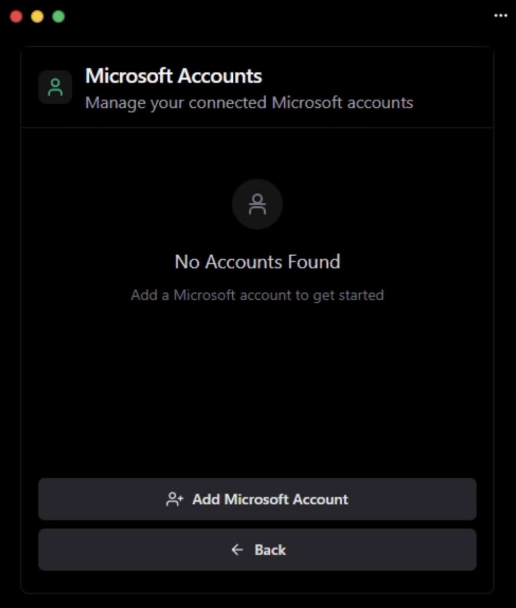
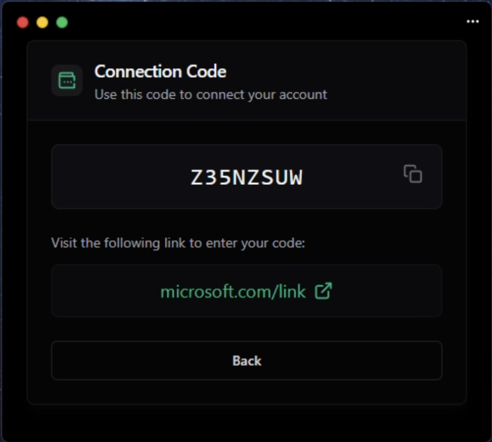
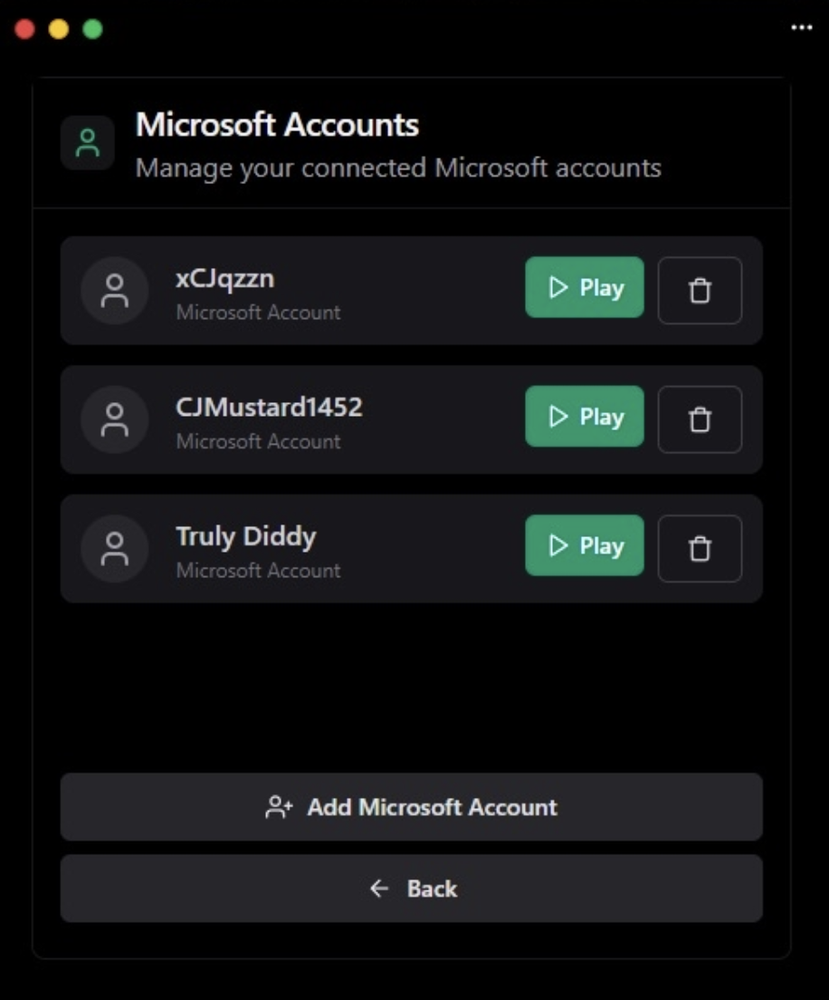
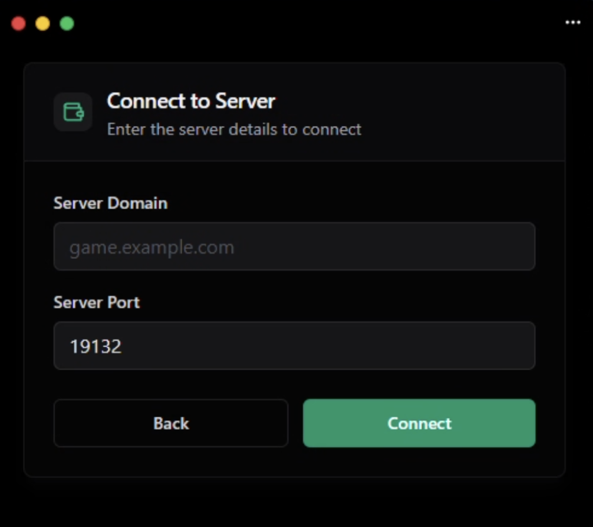
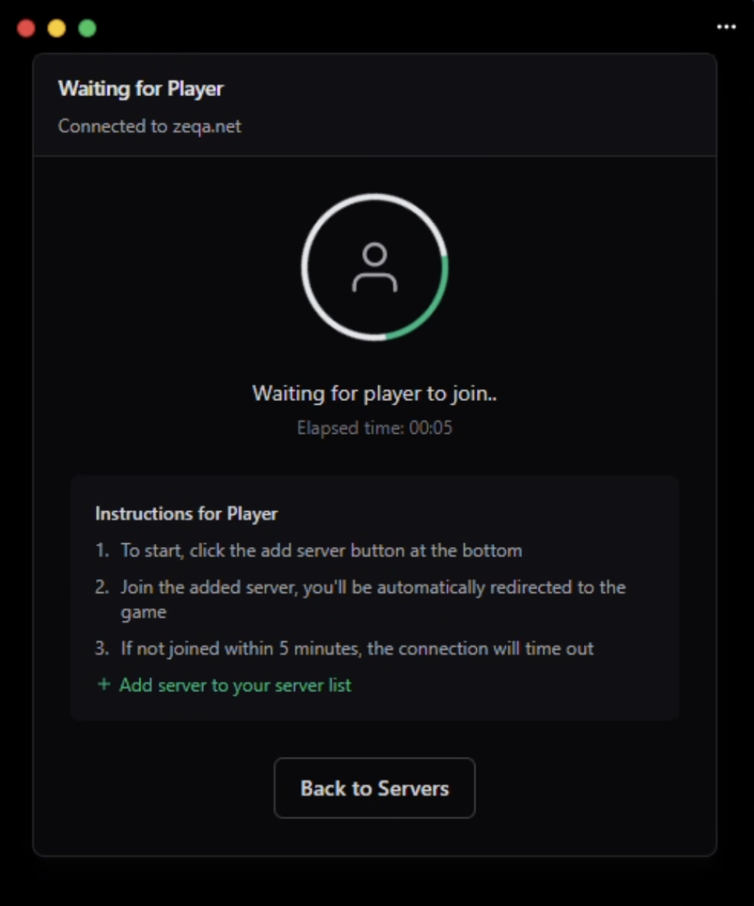

# Lumine Proxy

**Lumine Proxy** is a Gophertunnel-based Minecraft Bedrock Edition proxy responsible for handling proxy-side logic in the **Lumine** ecosystem.  
It is part of a multi-repository project including the client, launcher, API, and Discord bot.

---

## Project Structure

The Lumine ecosystem is divided into several components:

- **client** – Wails & Next.js based web application handling Lumine Proxy’s frontend.  
- **proxy** – Gophertunnel-based proxy for Bedrock Edition logic (this repository).  
- **launcher** – Golang-based launcher that manages obfuscated Lumine builds during runtime.  
- **api** – REST API (Go) for key handling and distributing production models.  
- **discord** – Rust + Serenity based Discord bot for generating Lumine keys.  
- **gophertunnel** – General purpose Bedrock library in Go (MIT Licensed).  

---

## Screenshots

Below are previews of the **Lumine Client** that integrates with Lumine Proxy:

  
  
  

  
  
  

---

## Tech Stack

- **Go** – Core proxy logic (Gophertunnel).  
- **TypeScript / Next.js / Wails** – Frontend client.  
- **Rust (Serenity)** – Discord bot.  
- **REST API** – Backend key distribution.  

---

## Features

- Built-in utility & exploit commands (toggleable) such as:  
  - ANTI KNOCKBACK  
  - AUTO CLICK  
  - FAKE OP  
  - FAST EAT  
  - FLY  
  - FREE CAM  
  - GAME MODE  
  - HELP  
  - HIT BOX  
  - KILL AURA  
  - NO CLIP  
  - NO PACKET  
  - PING  
  - REACH  
  - READ NBT  
  - REFUSE TP  
  - TELEPORT  
  - TIMER  
  - VELOCITY  

